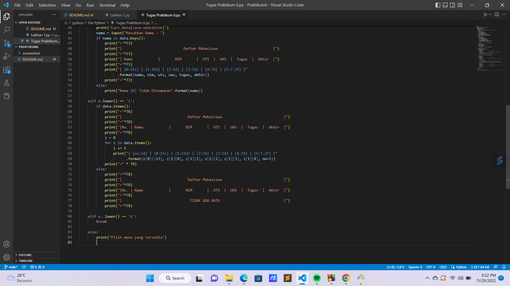

# Tugas Praktikum {Pertemuan ke 11}  

|**Nama**|**NIM**|**Kelas**|**Matkul**|
|----|---|-----|------|
|Muhammad Ikhsan Fakhrudin|312210019|TI.22.A2|Pemrograman|

# Latihan 1


# Kode Program


# Output

Maka hasil nya akan seperti ini :


# Tugas Praktikum


# Kode Program




# Penjelasan

`Membuat dictionary` yang akan diinput dengan data.

```
data = {}
```

`Membuat perulangan` dan keterangan untuk pilihan menu.

```
while True:
    header="PROGRAM INPUT NILAI MAHASISWA"
    header2=("MENU UTAMA")
    print(header.center(97,"="))
    print()
    print(header2.center(97,"_"))
    c = input("\n(L)ihat, (T)ambah, (U)bah), (H)apus, (C)ari, (K)eluar: ")
```

`Menambahkan data` yang akan diinput kemudian masuk ke dalam dictionary.

```
if c.lower() == 't':
        print("Tambah Data")
        nama = input("Nama\t\t: ")
        nim = int(input("NIM\t\t: "))
        uts = int(input("Nilai UTS\t: "))
        uas = int(input("Nilai UAS\t: "))
        tugas = int(input("Nilai Tugas\t: "))
        akhir = tugas*30/100 + uts*35/100 + uas*35/100
        data[nama] = nim, uts, uas, tugas, akhir
```

**Output Menambahkan data.**


Jika ingin `Menampilkan/Melihat data` , dapat menggunakan :

```
elif c.lower() == 'l':
        if data.items():
            print("="*88)
            print("|                               Daftar Mahasiswa                             |")
            print("="*88)
            print("|No. | Nama                      |       NIM       |  UTS  |  UAS  |  Tugas  |  Akhir  |")
            print("="*88)
            i = 0
            for z in data.items():
                i += 1
                print("| {no:2d} | {0:15s} | {1:15d} | {2:5d} | {3:5d} | {4:7d} | {5:7.2f} |"
                      .format(z[0][:25], z[1][0], z[1][1], z[1][2], z[1][3], z[1][4], no=i))
            print("=" *88)
        else:
            print("="*78)
            print("|                               Daftar Mahasiswa                             |")
            print("="*78)
            print("|No. | Nama            |       NIM       |  UTS  |  UAS  |  Tugas  |  Akhir  |")
            print("="*78)
            print("|                                TIDAK ADA DATA                              |")
            print("="*78)
```

**Output Tampilan data yg sudah berhasil di input.**


Jika ingin `Mengubah data` dapat menggunakan :

```
elif c.lower() == 'u':
        print("Ubah Data")
        nama = input("Masukkan Nama   : ")
        if nama in data.keys():
            nim = int(input("NIM\t\t: "))
            uts = int(input("Nilai UTS\t: "))
            uas = int(input("Nilai UAS\t: "))
            tugas = int(input("Nilai Tugas\t: "))
            akhir = tugas*30/100 + uts*35/100 + uas*35/100
            data[nama] = nim, uts, uas, tugas, akhir
        
        else:
            print("Nama {0} tidak ditemukan".format(nama))
```

**Output Mengubah data.**


Jika ingin `Mencari data` dapat menggunakan :

```
elif c.lower() == 'c':
        print("Cari Data")
        nama = input("Masukkan Nama : ")
        if nama in data.keys():
            print("="*88)
            print("|                             Daftar Mahasiswa                          |")
            print("="*88)
            print("| Nama                      |       NIM       |  UTS  |  UAS  |  Tugas  |  Akhir  |")
            print("="*88)
            print("| {0:20s} | {1:15d} | {2:5d} | {3:5d} | {4:7d} | {5:7.2f} |"
                  .format(nama, nim, uts, uas, tugas, akhir))
            print("="*88)
        else:
            print("Nama {0} Tidak Ditemukan".format(nama))
```

**Output data yg ingin di cari.**


Jika ingin `Menghapus data` dapat menggunakan :

```
elif c.lower() == 'h':
        print("Hapus Data")
        nama = input("Masukkan Nama  : ")
        if nama in data.keys():
            del data[nama]
        else:
            print("Nama {0} Tidak Ditemukan".format(nama))
```

**Output data yg telah di hapus.**


**Sekian Tugas Praktikum di Pertemuan kali ini.**

**Jika Ada yg Salah Sama Minta Maaf.**

**Wassalamualaikum wr.wb.**


